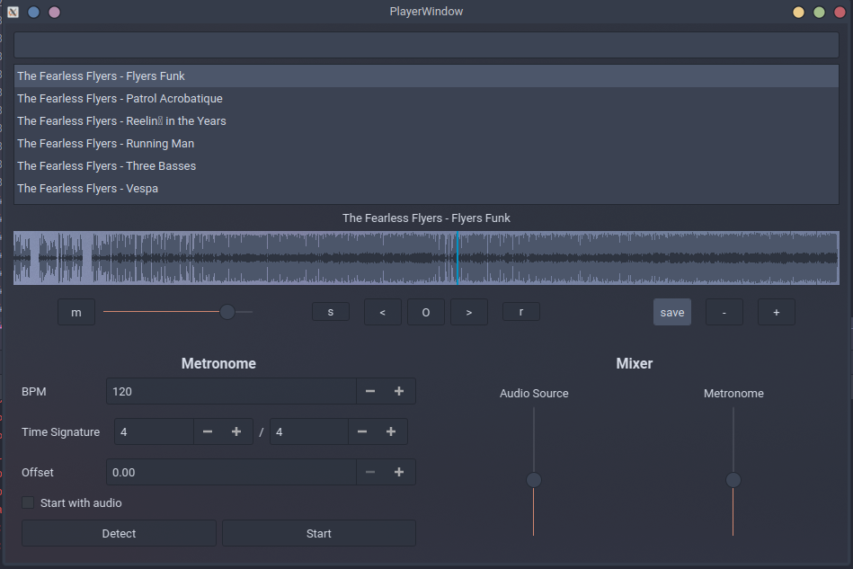

# Lit AudioPlayer
Most useful audioplayer for music practise.

Features:
* Playlists
* Metronome with custom time signatures
* Metronome to music tempo sync
* Repeat fragment
* Waveform preview
* Channel mixing

